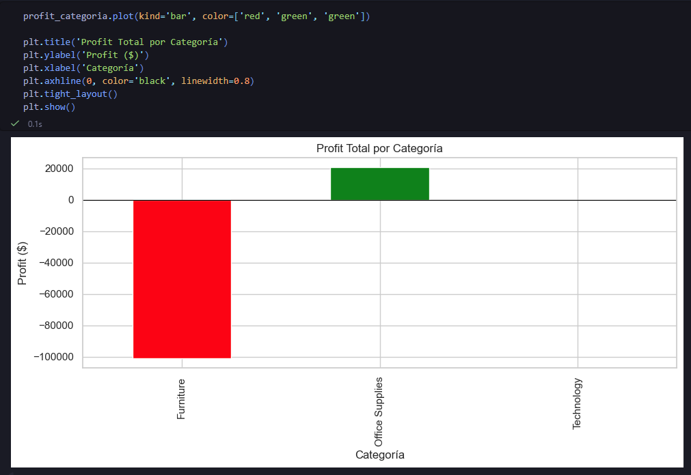
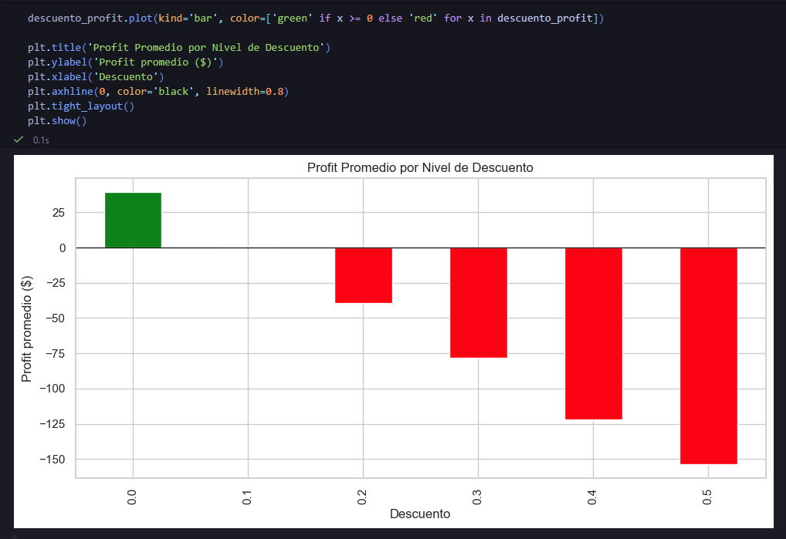
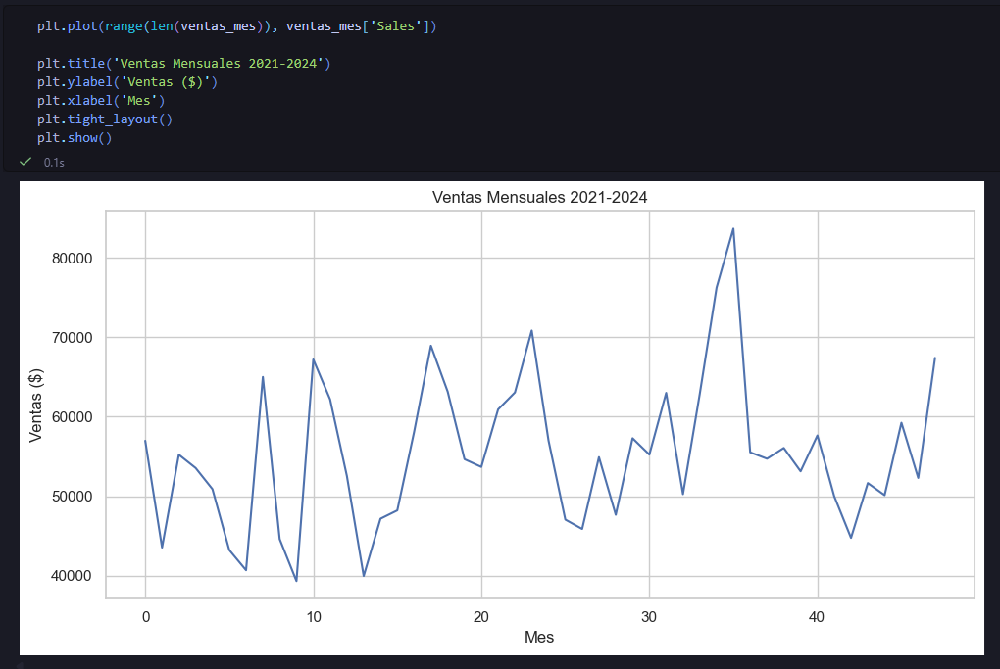
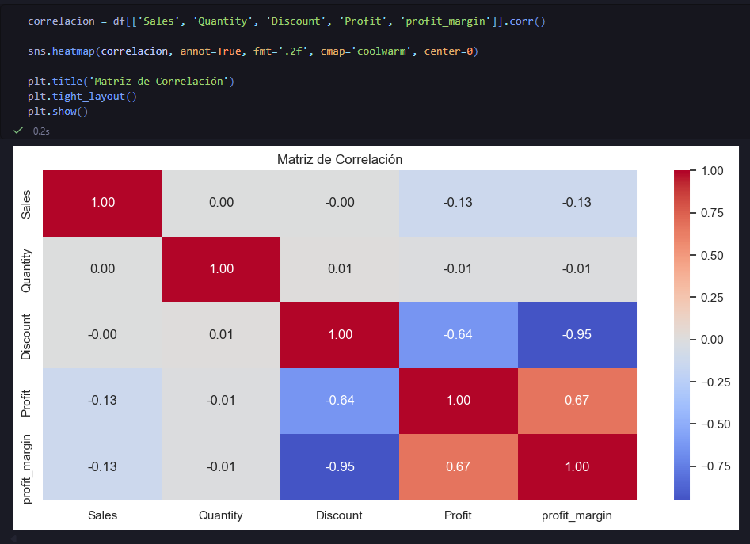

# 🛒 Retail Sales Analytics

Análisis exploratorio de datos (EDA) y modelo predictivo de ventas retail aplicado a ~10.000 transacciones reales. Proyecto desarrollado para demostrar manejo práctico de Python aplicado a análisis de datos.

## 🛠️ Stack
`pandas` `numpy` `matplotlib` `seaborn` `scipy` `scikit-learn`

---

## 📊 Hallazgos principales

### 1. Furniture lidera ventas pero genera pérdidas
La categoría con mayor volumen de ventas ($1.27M) es la única que opera en pérdida (-$100K).
Office Supplies, con menos ventas, es la más rentable.



---

### 2. Los descuentos destruyen el margen
Cualquier descuento superior al 10% genera pérdidas en promedio.
Con 50% de descuento, la pérdida promedio es de $153 por transacción.



---

### 3. Estacionalidad anual clara
Las ventas muestran un patrón estacional repetible año a año con pico en Q4.



---

### 4. Correlación entre variables
Confirmación estadística: Discount y profit_margin tienen correlación de -0.95.



---

## 🔬 Test estadístico (scipy)
ANOVA entre las 4 regiones del negocio:

```python
f_stat, p_value = stats.f_oneway(west, east, central, south)
# F-statistic: 0.3171
# P-value:     0.8130
# → No hay diferencia significativa entre regiones
```

**Conclusión:** Las diferencias de ventas entre regiones son ruido estadístico, no una tendencia real. No justifica estrategias diferenciadas por región.

---

## 🤖 Modelo Predictivo

Regresión lineal para predecir ventas mensuales usando año y mes como features:

```python
modelo = LinearRegression()
modelo.fit(X_train, y_train)

# MAE:  $4,318
# RMSE: $4,976
# R²:   -0.786
```

El modelo base muestra limitaciones — year y month solos no capturan la estacionalidad no lineal del negocio. Próximo paso: features cíclicas con seno/coseno del mes o modelos de series temporales como Prophet.

---

## 📁 Archivos
| Archivo | Descripción |
|---|---|
| `fase1_eda.ipynb` | Notebook completo con EDA y modelo |
| `superstore.csv` | Dataset de ~10.000 transacciones retail |

---

## 👤 Autor
**Pablo Pareja**  
[](https://www.linkedin.com/in/ppareja/)
